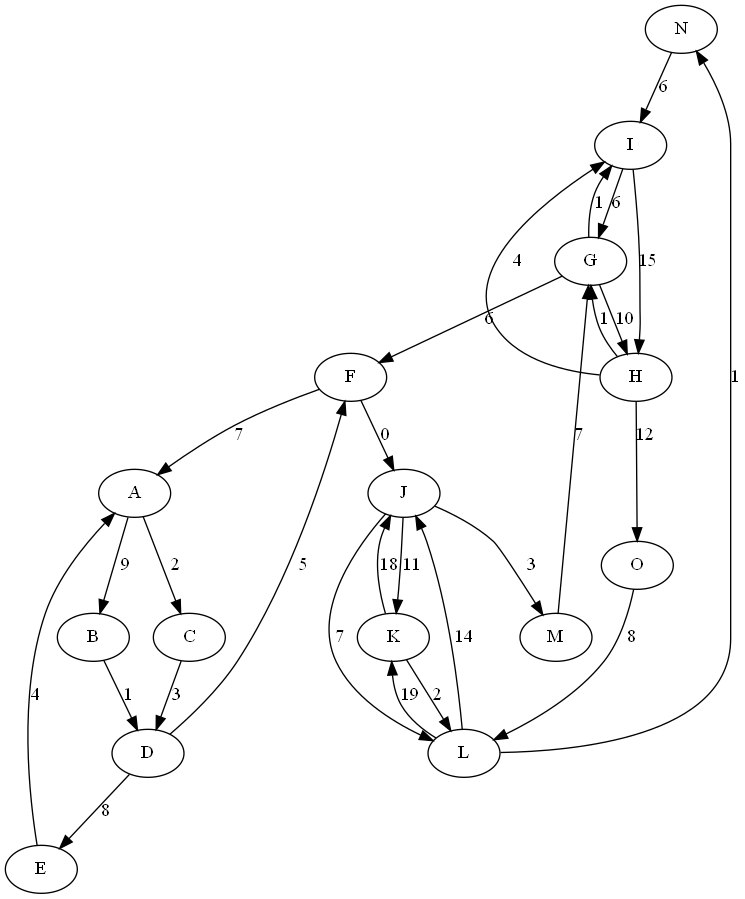
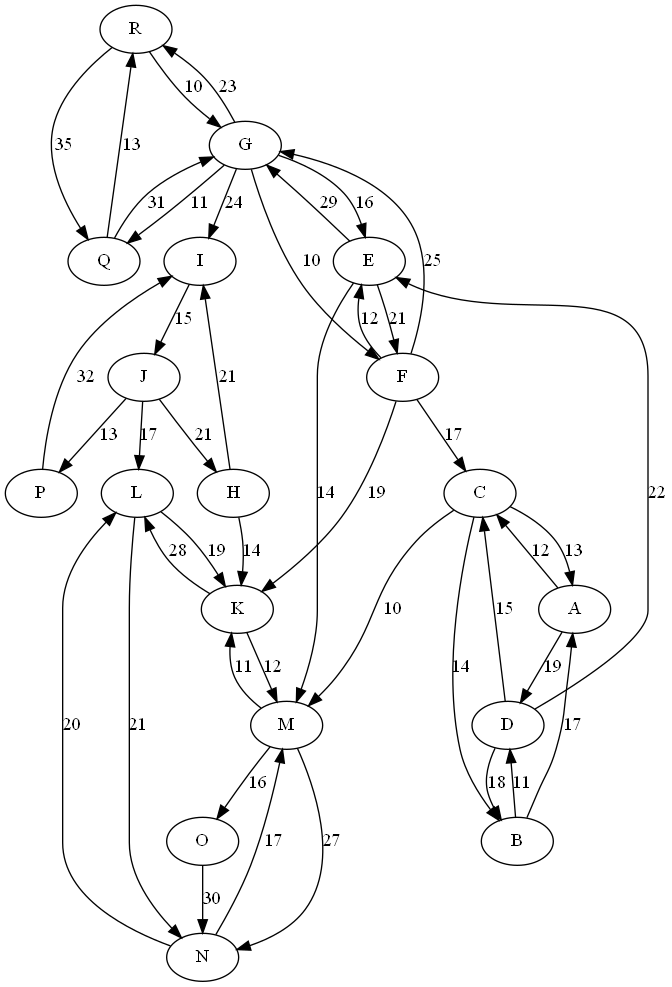
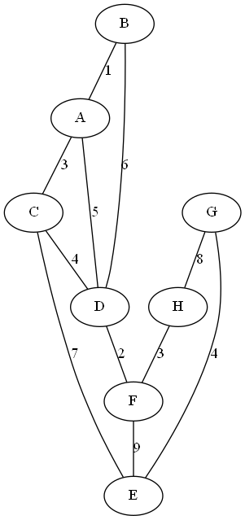
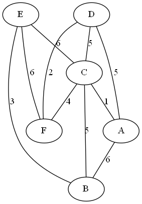

# Algoritmos y Estructura de Datos
## Proyecto sobre Grafos
--------

## Integrantes ✒️

- Luis Gutiérrez [Luis-ntonio] Participación: 100%
- Marcos Ayala [Marcos-1001] Participación: 100%
- Alexandra Shulca [Alexandra-SR] Participación: 100%

## Profesor 🦾

- Heider Sanchez Enriquez

## Asistentes de docencia
- Paolo Morey Tutiven
- Jorge Castillo Migone

----

## Objetivos Principales :dart:

El proyecto del curso consiste en implementar una estructura de datos de grafo y un file parser. La estructura debe soportar los métodos y algoritmos descritos a continuacion:

## Comenzando 🚀

### Pre-requisitos 📋
* [C++ 17](https://nuwen.net/mingw.html) 
* [Graphviz](https://graphviz.org/download/)


### Despliegue 📦

**1.** Clonar el repositorio del proyecto.

**2.** Realizar el Build del proyecto utilizando el IDE CLion.

**3.** Ejecutar el programa


### Generar gráficos

Para la representación visual usamos Graphviz. Un software de visualización gráfica open source. La visualización  es una forma de representar información estructurada como diagramas de grafos y redes abstractas.

* Descarga: 
Los paquetes de código fuente para las últimas versiones estables y de desarrollo de Graphviz están disponibles, junto con instrucciones para el acceso anónimo a las fuentes usando Git . [Click aquí](https://graphviz.org/download/)

En el proyecto usamos archivos mediante la librería <fstream>. El uso de archivos fue vital para la generación de gráficos.
Hicimos métodos en el grafo no dirigido y el dirigido para generar archivos en el lenguaje DOT. La siguiente es una gramática abstracta que define el lenguaje DOT.
 
```
  grafico	:	[ estricto ] ( gráfico | dígrafo ) [ ID ] '{' stmt_list '}'
stmt_list	:	[ stmt [ ';' ] stmt_list ]
stmt	:	node_stmt
        |	edge_stmt
        |	attr_stmt
        |	ID '=' ID
        |	subgrafo
attr_stmt	:	( gráfico | nodo | borde ) attr_list
attr_list	:	'[' [ a_list ] ']' [ attr_list ]
una lista	:	ID '=' ID [( ';' | ',' )] [ a_list ]
edge_stmt	:	( node_id | subgraph ) edgeRHS [ attr_list ]
edgeRHS	:	edgeop ( node_id | subgrafo ) [ edgeRHS ]
node_stmt	:	node_id [ attr_list ]
node_id	:	ID [ puerto ]
Puerto	:	':' ID [ ':' compass_pt ]
        |	':' compass_pt
subgrafo	:	[ subgrafo [ ID ]] '{' stmt_list '}'
compass_pt	:	( n | ne | e | se | s | sw | w | nw | c | _ )
```
  
 Una vez generado el archivo, se ejecuta el siguiente comando para generar la imagen. 
 ``` 
 dot -Tpng nombre.dot -onombre.png
```

## Graph data structure 🚀

* El grafo debe ser dinámico (inserciones. eliminaciones, búsquedas, ...)
* Se debe implementar los dos tipos de grafos: dirigidos y no-dirigidos.
* No considerar loops ni multi-arista.


### Methods:
```cpp
bool insertVertex(string id, V data); // Creates a new vertex in the graph with some data and an ID

bool createEdge(string start, string end, E data); // Creates a new edge in the graph with some data

bool deleteVertex(string id); // Deletes a vertex in the graph

bool deleteEdge(string start, string end); // Deletes an edge in the graph, it is not possible to search by the edge value, since it can be repeated

E &operator()(string start, string end); // Gets the value of the edge from the start and end vertexes

float density() const; // Calculates the density of the graph

bool isDense(float threshold = 0.5) const; // Calculates the density of the graph, and determine if it is dense dependening on a threshold value

bool isConnected(); // Detect if the graph is connected

bool isStronglyConnected() throw(); // Detect if the graph is strongly connected (only for directed graphs)

bool empty(); // If the graph is empty

void clear(); // Clears the graph
```
## Pruebas 


### Grafo 1  dirigido
<figure align="center" class="image">
  
</figure>

### Grafo 2 dirigido
<figure class="image" align="center">
  
</figure>

### Grafo 3 dirigido
<figure class="image" align="center">
  
</figure>


### Grafo 1 no dirigido
<figure align="center" class="image">
  
</figure>

### Grafo 2 no dirigido
<figure class="image" align="center">
  
</figure>

### Grafo 3 no dirigido
<figure class="image" align="center">
  
</figure>


##  Grafo no dirigido 💯

### Especificaciones de los métodos (UnDirectedGraph)

```cpp
template<typename TV, typename TE>
bool UnDirectedGraph<TV, TE>::insertVertex(string id, TV vertex) {
    if (this->vertexes.find(id) != this->vertexes.end())
        return false;
    auto *new_vertex = new Vertex<TV, TE>;
    new_vertex->data = vertex;
    new_vertex->id = id;
    this->vertexes[id] = new_vertex;
    return true;
}
```
Para insertar un nuevo vértice, principalmente, necesitamos verificar si existe un otro con el mismo id.
En caso, no exista un vértice así, entonces creamos un objeto Vertex, le asignamos la data y un id, para finalmente
insertarlo en el unordered_map.


```cpp

template<typename TV, typename TE>
bool UnDirectedGraph<TV, TE>::createEdge(string id1, string id2, TE w) {
    if (this->vertexes.find(id1) == this->vertexes.end() || this->vertexes.find(id2) == this->vertexes.end())
        return false;

    auto *new_edge = new Edge<TV, TE>;
    new_edge->vertexes[0] = this->vertexes[id1];
    new_edge->vertexes[1] = this->vertexes[id2];
    new_edge->weight = w;

    this->vertexes[id1]->edges.push_back(new_edge);

    auto *new_edge1 = new Edge<TV, TE>;
    new_edge1->vertexes[1] = this->vertexes[id1];
    new_edge1->vertexes[0] = this->vertexes[id2];
    new_edge1->weight = w;

    this->vertexes[id2]->edges.push_back(new_edge1);
    E++;
    return true;
}
```

createEdge en Undirected graph verifica si los vértices que se desean 
conectar existen en el grafo. Si existen, se conectan entre ambos;
es decir, el id1 se conecta con el id2 y viceversa. Finalmente se
incrementa el tamaño de edges y retorna true.


```cpp
template<typename TV, typename TE>
bool UnDirectedGraph<TV, TE>::deleteVertex(string id) {
if (this->vertexes.find(id) == this->vertexes.end())
return false;

deleteEdge(id);
this->vertexes.erase(id);

return true;
}
```
El deleteVertex para el undirected graph, verifica si existe el vértice que se desea
eliminar, si existe se llama a la función deleteEdge para la eliminación de las
aristas que se conectan al vértice. Finalmente, se elimina el vértice aislado.
```cpp
template<typename TV, typename TE>
bool UnDirectedGraph<TV, TE>::deleteEdges(string id) {
if (this->vertexes.find(id) == this->vertexes.end())
return false;

    auto all_edges = &(this->vertexes[id])->edges;

    while (!all_edges->empty()) {
        auto get_start_vertex = (*all_edges->begin())->vertexes[0];
        auto get_goal_vertex = (*all_edges->begin())->vertexes[1];

        for (auto i = (get_goal_vertex->edges).begin(); i != (get_goal_vertex->edges).end(); i++) {
            if ((*i)->vertexes[1] == get_start_vertex) {
                (get_goal_vertex->edges).erase(i);
                E--;
                break;
            }
        }
        all_edges->pop_front();
    }
    return true;
}
```
deleteEdges se encarga de aislar un vertice para poder realizar una correcta eliminacion de datos.
Para esto primero revisa si el vértice a eliminar existe en el grafo, si es el caso, se procede a eliminar 
todas las aristas conectadas a este de forma iterativa hasta que no quede ninguna arista y retorna true.
```cpp
template<typename TV, typename TE>
bool UnDirectedGraph<TV, TE>::deleteEdge(string start, string end){

    auto all_edges = &(this->vertexes[start])->edges;
    for (auto i = all_edges->begin(); i != all_edges->end(); i++) {
        if (((*i)->vertexes[1])->id == end) {
            all_edges->erase(i);
        }
    }

    auto all_edges1 = &(this->vertexes[end])->edges;
    for (auto i = all_edges1->begin(); i != all_edges1->end(); i++) {
        if (((*i)->vertexes[1])->id == start) {
            all_edges1->erase(i);
            
        }
    }
    E--;
  return true;
}
```
Similar al deleteEdges, el deleteEdge realiza la misma acción pero únicamente para una arista
específica; es decir, si la arista está conectada por la variable "start" y "end" se elimina.
Caso contrario sigue buscando entre las aristas de "start" hasta hallar una que coincida para eliminarla.
Si no existe ninguna, retornará false.

```cpp
template<typename TV, typename TE>
bool UnDirectedGraph<TV, TE>::empty() {
    return this->vertexes.size() == 0;
}
```
La función empty se encarga de verificar si el grafo se encuentra vacío o cuenta con algún vértice insertado.

```cpp
template<typename TV, typename TE>
void UnDirectedGraph<TV, TE>::clear() {
    while (!this->vertexes.empty()) {
        auto i = *this->vertexes.begin();
        deleteVertex(i.first);

    }
}
```
El objetivo de clear es, mientras el vector de vértices no esté vacío, toma el vértice
que se encuentra al inicio del vector y llama a la función deleteVertex.
```cpp
template<typename TV, typename TE>
bool UnDirectedGraph<TV, TE>::findById(string id) {
    if (this->vertexes.find(id) == this->vertexes.end()) return false;
    return true;
}
```

El findById es una función booleana que retorna verdadero en caso se encuentre
un vector con el Id solicitado; caso contrario, retorna false.


````cpp
template<typename TV, typename TE>
void UnDirectedGraph<TV, TE>::displayVertexFile(ofstream &filename, string id) {
    if (this->vertexes.find(id) == this->vertexes.end())
        return;

    auto all_edges = (this->vertexes[id])->edges;
    auto ids = id;
    for (auto i: all_edges) {
        for (auto it = this->vertexes.begin(); it != this->vertexes.end(); ++it) {
            if (it->second == (*i).vertexes[1]) ids = it->first;
        }

        filename << id <<" -- "<< ids << " [label = \""<< (*i).weight<<"\"];"<<endl;
    }
}
````
Esta función se encarga de guardar los vértices
y las aristas que se conectan a un vértice que funciona como padre del grafo que se indica en la declaración de la función
en la dirección del filename.


````cpp
template<typename TV, typename TE>
void UnDirectedGraph<TV, TE>::display_file(ofstream &filename){

    filename <<"digraph graph1{ "<<endl;
    for (auto i: this->vertexes) {
        displayVertexFile(filename, i.first);
    }
    filename <<" } ";
}
````
Lo que hace esta función es llamar iterativamente a diplayVertexFile, de esta manera,
el archivo va a contener todas las aristas del grafo y sus conexiones para poder realizar un display más adalante.


````cpp
template<typename TV, typename TE>
void UnDirectedGraph<TV, TE>::display() {
    for (auto i: this->vertexes) {
        displayVertex(i.first);
    }
}
````

La función display recorre el contenedor vertexes y por cada vértice, llama a la función displayVertex y muestra en pantalla todas las
aristas y sus respectivos vértices que estan conectados dentro del grafo.


````cpp
template<typename TV, typename TE>
float UnDirectedGraph<TV, TE>::density() {
    int V = this->vertexes.size();
    return 2 * E / ((float) V * (V - 1));
}
````
Esta función nos permite calcular la densidad del grafo siguiendo la ecuación 2 * (cantidad de aristas)/(cantidad de vertices) * (cantidad de vertices - 1)


````cpp
template<typename TV, typename TE>
bool UnDirectedGraph<TV, TE>::isDense(float threshold) {
    return this->density() > threshold;
}
````
isDense verifica si la densidad del grafo es mayor threshold

````cpp
template<typename TV, typename TE>
TE &UnDirectedGraph<TV, TE>::operator()(string start, string end) {
    if (!findById(start))
        throw out_of_range("Vertex not found");
    auto par = this->vertexes[start]->edges;
    for (auto it : par) {
        if (it->vertexes[0] == this->vertexes[end] || it->vertexes[1] == this->vertexes[end]) {
            return it->weight;
        }
    }
    throw std::out_of_range("Edge not found");
}
````
Para iniciar la función, se debe comprobar si el vértice de inicio existe en el grafo, caso contrario,
se retorna el error "fuera de rango". Si el vértice existe se procede a iterar por las aristas que están conectadas
con el vértice de inicio y comprueban si el otro vértice es el "end" para poder retornar el peso de la arista.
Si no se encuentra ningún vértice que coincida con el "end", lanza un error de "Edge not found".
````cpp
template<typename TV, typename TE>
bool UnDirectedGraph<TV, TE>::isStronglyConnected() throw() {
    if(this->isConnected()){return true;}
    else{return false;}
}
````
Debido a que las conexiones entre los vértices en el UnDirectedGraph son bidireccionales, desde
un vértice siempre se podrá llegar a todos los vértices dentro del grafo. Por lo tanto, la función
siempre retornará true.

````c++
template<typename TV, typename TE>
bool UnDirectedGraph<TV, TE>::isConnected() {
    std::set<string> visited;
    std::stack<Vertex<TV, TE>* > pila;

    string fid = (*this->vertexes.begin()).first;
    visited.insert(fid);

    for (auto i : (*this->vertexes.begin()).second->edges) {
        Vertex<TV, TE> *ax = i->vertexes[1];
        if (visited.find(ax->id) == visited.end()) {
            pila.push(ax);
        }
    }

    while (!pila.empty()) {
        Vertex<TV, TE> *to_insert = pila.top();
        pila.pop();
        visited.insert(to_insert->id);

    for (auto i : to_insert->edges) {
        Vertex<TV, TE> *ax = i->vertexes[1];
        if (visited.find(ax->id) == visited.end()) {
            pila.push(ax);
        }
    }
}
if (visited.size() == this->vertexes.size()){return true;}
}
````

La funcion isconected tiene como objetivo, comprobar si desde el vértice solicitado
se puede llegar a todos los vertices del grafo. Par esta implementcación, implementamos
una estuctura de código similar a la del dfs, anexa las aristas anexadas al vértice de inicio
para saber a qué vértices está conectado. Luego verifica si esos vértices ya se han visitado,
si no lo han sido, se añaden a la pila y se marca como visitado hasta verificar todos los vértices.
Finalmente, si el tamaño de la pila es igual a la cantidad de vértices, retorna true.
##  Grafo dirigido 🔝

### Especificaciones de los métodos (DirectedGraph)
````cpp
template<typename TV, typename TE>
bool DirectedGraph<TV, TE>::insertVertex(string id, TV vertex) {
    if (this->vertexes.find(id) != this->vertexes.end())
        return false;

    auto *new_vertex = new Vertex<TV, TE>;
    new_vertex->data = vertex;
    new_vertex->id = id;
    this->vertexes[id] = new_vertex;

    return true;
}
````
La función, insertVertex verifica primero si existe algún vértice con id igual al que se desea
ingresar, si es así, se añade un vértice nuevo con el peso e id solicitado.

```cpp
template<typename TV, typename TE>
bool DirectedGraph<TV, TE>::createEdge(string id1, string id2, TE w) {
    if (this->vertexes.find(id1) == this->vertexes.end() && this->vertexes.find(id2) == this->vertexes.end())
        return false;

    auto *new_edge = new Edge<TV, TE>;
    new_edge->vertexes[0] = this->vertexes[id1];
    new_edge->vertexes[1] = this->vertexes[id2];
    new_edge->weight = w;

    this->vertexes[id1]->edges.push_back(new_edge);
    E++;
    return true;
}
```
La función createEdge en Directed graph verifica si los vértices que se desean conectar existen en el grafo. Si existen, se conectan unilateralmente; es decir, el id1 se conecta con el id2.
Finalmente se inserta en el vector de edges el nuevo edge y retorna true.


```cpp
template<typename TV, typename TE>
bool DirectedGraph<TV, TE>::deleteVertex(string id) {
    if (this->vertexes.find(id) == this->vertexes.end())
        return false;
    deleteEdge(id);
    for (auto i = this->vertexes.begin(); i != this->vertexes.end(); i++) { //Revisa cada vértice a excepción del que se va a eliminar
        if ((*i).second != this->vertexes[id]) {
            auto list_of_edges = (*i).second->edges;

            for (auto j = list_of_edges.begin(); j != list_of_edges.end(); j++) { //Busco si existe una arista que conecte con el vértice id y la borro
                if ((*j)->vertexes[1] == this->vertexes[id]) {
                    (list_of_edges).erase(j);
                    break;
                }
            }
        }
    }
    this->vertexes.erase(id);
    return true;
}
```
La función deleteVertex en DirectedGraph recibe el id del vértice que se desea eliminar. En primer lugar, verifica si el vértice existe en el grafo, si no existe retorna false; caso contrario, procede a iterar por todos los
vértices (excluyendo al que se desea eliminar) y verifica si está conectados con el vértice buscado, en caso existiera una arista, se elimina.
Cuando no existan aristas, se elimina el vértice sin complicaciones.

````cpp
template<typename TV, typename TE>
bool DirectedGraph<TV, TE>::deleteEdges(string id) {
    if (this->vertexes.find(id) == this->vertexes.end())
        return false;

    auto all_edges = &(this->vertexes[id])->edges;

    while (!all_edges->empty()) { // Elimino aristas hasta que la lista de adyacencia quede vacía
        E--;
        all_edges->pop_front();
    }

    return true;
}
````
El deleteEdges se encarga de eliminar todas las aristas conectadas a un vértice, para poder aislarlo y, posteriormente, eliminarlo.
Sin embargo, antes de realizar dicha acción, se debe verificar que dicho vértice que se desea aislar existe en el grafo, caso contrario, retorna que no se logró
realizar la acción.

```cpp
template<typename TV, typename TE>
bool DirectedGraph<TV, TE>::empty() {
    return this->vertexes.size() == 0;
}
```
La función empty se encarga de verificar si el grafo se encuentra vacío o cuenta con algún vértice insertado.

```cpp
template<typename TV, typename TE>
void DirectedGraph<TV, TE>::clear() {
    while (!this->vertexes.empty()) {
        auto i = *this->vertexes.begin();
        deleteVertex(i.first);

    }
}
```
El objetivo de clear es, mientras el vector de vértices no esté vacío, toma el vértice
que se encuentra al inicio del vector y llama a la función deleteVertex.


```cpp
template<typename TV, typename TE>
bool DirectedGraph<TV, TE>::findById(string id) {
    if (this->vertexes.find(id) == this->vertexes.end()) return false;
    return true;
}
```

El findById es un booleano que retorna verdadero en caso se encuentre 
un vector con el Id solicitado; caso contrario, retorna false.

````cpp
template<typename TV, typename TE>
void DirectedGraph<TV, TE>::displayVertex(string id) {
    if (this->vertexes.find(id) == this->vertexes.end())
        return;

    auto all_edges = (this->vertexes[id])->edges;
    auto ids = id;
    for (auto i: all_edges) {
        for (auto it = this->vertexes.begin(); it != this->vertexes.end(); ++it) {
            if (it->second == (*i).vertexes[1]) ids = it->first;
        }

        std::cout << "weight from vertex " << id << " to vertex " << ids << " is " << (*i).weight << endl;
    }
}
````
displayVertex muestra en consola el peso de las aristas conectadas
desde el vértice solicitado hasta los vértices conectados a este.

````cpp
template<typename TV, typename TE>
void DirectedGraph<TV, TE>::displayVertexFile(ofstream &filename, string id) {
    if (this->vertexes.find(id) == this->vertexes.end())
        return;

    auto all_edges = (this->vertexes[id])->edges;
    auto ids = id;
    for (auto i: all_edges) {
        for (auto it = this->vertexes.begin(); it != this->vertexes.end(); ++it) {
            if (it->second == (*i).vertexes[1]) ids = it->first;
        }

        filename << id <<" -> "<< ids << " [label = \""<< (*i).weight<<"\"];"<<endl;
    }
}
````
Esta función se encarga de, en una dirección de archivo ingresada, guardar los vértices 
y las aristas que se conectan a un vértice que funciona como padre del grafo que se indica en la declaración de la función.

 

````cpp
template<typename TV, typename TE>
void DirectedGraph<TV, TE>::display_file(ofstream &filename){

    filename <<"digraph graph1{ "<<endl;
    for (auto i: this->vertexes) {
        displayVertexFile(filename, i.first);
    }
    filename <<" } ";
}
````
Lo que hace esta función es llamar iterativamente a la función explicada anteriormente, de esta manera,
el archivo va a contener todas las aristas del grafo y sus conexiones para poder realizar un display más adalante.


````cpp
template<typename TV, typename TE>
void DirectedGraph<TV, TE>::display() {
    for (auto i: this->vertexes) {
        displayVertex(i.first);
    }
}
````

La función display recorre el contenedor vertexes y por cada vértice, llama a la función displayVertex y muestra en pantalla todas las 
aristas y sus respectivos vértices que estan conectados dentro del grafo.


````cpp
template<typename TV, typename TE>
float DirectedGraph<TV, TE>::density() {
    int V = this->vertexes.size();
    return 2 * E / ((float) V * (V - 1));
}
````
Esta función nos permite calcular la densidad del grafo siguiendo la ecuación 2 * (cantidad de aristas)/(cantidad de vertices) * (cantidad de vertices - 1)


````cpp
template<typename TV, typename TE>
bool DirectedGraph<TV, TE>::isDense(float threshold) {
    return this->density() > threshold;
}
````
isDense verifica si la densidad del grafo es mayor threshold

````cpp
template<typename TV, typename TE>
TE &DirectedGraph<TV, TE>::operator()(string start, string end) {
    if (!findById(start))
        throw out_of_range("Vertex not found");
    auto par = this->vertexes[start]->edges;
    for (auto it : par) {
        if (it->vertexes[0] == this->vertexes[end] || it->vertexes[1] == this->vertexes[end]) {
            return it->weight;
        }
    }
    throw std::out_of_range("Edge not found");
}
````
Para iniciar la función, se debe comprobar si el vértice de inicio existe en el grafo, caso contrario,
se retorna el error "fuera de rango". Si el vértice existe se procede a iterar por las aristas que están conectadas
con el vértice de inicio y comprueban si el otro vértice es el "end" para poder retornar el peso de la arista.
Si no se encuentra ningún vértice que coincida con el "end", lanza un error de "Edge not found".
````cpp
template<typename TV, typename TE>
bool DirectedGraph<TV, TE>::isStronglyConnected() throw() {
    for(auto &j : this->vertexes){
        std::unordered_set<string> visited;
        std::stack<Vertex<TV, TE> *> pila;

        visited.insert(j.first);

        for (auto i : j.second->edges) {
            Vertex<TV, TE> *ax = i->vertexes[1];
            if (visited.find(ax->id) == visited.end()) {
                pila.push(ax);
            }
        }


        while (!pila.empty()) {
            Vertex<TV, TE> * to_insert = pila.top();
            pila.pop();
            visited.insert(to_insert->id);

            for (auto i : to_insert->edges) {
                Vertex<TV, TE> *ax = i->vertexes[1];
                if (visited.find(ax->id) == visited.end()) {
                    pila.push(ax);
                }
            }
        }
        if (visited.size() != this->vertexes.size()){return false;}
    }
    return true;
}
````
Esta función de complejidad de O(n^2) se encarga de verificar vértice por vértice, todas las aristas que los conectan
con el objetivo de verificar si desde un vértice se puede llegar a recorrer todo el grafo.
Si alguno de los vértices no logra recorrer todo el grafo, retorna false. Caso contrario, el grafo puede recorrerse
completamente por cualquier vértice perteneciente a este, retorna true.

````c++
template<typename TV, typename TE>
bool DirectedGraph<TV, TE>::isConnected() {
    for(auto &j : this->vertexes){
        std::unordered_set<string> visited;
        std::stack<Vertex<TV, TE> *> pila;

        visited.insert(j.first);

        for (auto i : j.second->edges) {
            Vertex<TV, TE> *ax = i->vertexes[1];
            if (visited.find(ax->id) == visited.end()) {
                pila.push(ax);
            }
        }

        while (!pila.empty()) {
            Vertex<TV, TE> * to_insert = pila.top();
            pila.pop();
            visited.insert(to_insert->id);

            for (auto i : to_insert->edges) {
                Vertex<TV, TE> *ax = i->vertexes[1];
                if (visited.find(ax->id) == visited.end()) {
                    pila.push(ax);
                }
            }
        }
        if (visited.size() == this->vertexes.size()){return  true;}
    }
    return false;
}
````

La funcion isconected tiene como objetivo, comprobar si desde el vértice solicitado
se puede llegar a todos los vertices del grafo. Par esta implementcación, implementamos 
una estuctura de código similar a la del dfs, anexa las aristas anexadas al vértice de inicio
para saber a qué vértices está conectado. Luego verifica si esos vértices ya se han visitado,
si no lo han sido, se añaden a la pila y se marca como visitado hasta verificar todos los vértices.
Finalmente, si el tamaño de la pila es igual a la cantidad de vértices, retorna true.


### Algorithms:
```cpp
//Given the graph
UndirectedGraph<char, int> graph;

//1- Generates a MST graph using the Kruskal approach (only for undirected graphs)
Kruskal<char, int> kruskal(&graph);
UndirectedGraph<char, int> result = kruskal.apply();//return a tree

//2- Generates a MST graph using the Prim approach (only for undirected graphs)
Prim<char, int> prim(&graph, "A");
UndirectedGraph<char, int> result = prim.apply();//return a tree

//3- A *
AStar<char, int> astar(&graph, "A", "Z", vector<int> heuristics);
UndirectedGraph<char, int> result = astar.apply();

```

### kruskal.h
````cpp
void minimal(){
        sort(edges.begin(), edges.end());
        int k= 0;
        for (EdgeE<TV, TE> e : edges) {
            if (Find(e.u) != Find(e.v)) {
                cost += e.weight;
                result.push_back(e);
                Union(e.u, e.v);
            }
        }
}

UnDirectedGraph<TV, TE>* apply(){
        this->minimal();
        G = new UnDirectedGraph<TV, TE>();
        for(pair<string, Vertex<TV, TE> *> vertex: aux_graph->vertexes)
            G->insertVertex(vertex.first, vertex.second->data);
        for (auto edge : result){
            string aux1 , aux2;
            int k =0;
            for(pair<string, Vertex<TV, TE> *> vertex: aux_graph->vertexes){
                if (k == edge.u)
                    aux1 = vertex.first;
                if(k == edge.v)
                    aux2 = vertex.first;
                k++;
            }
            G->createEdge(aux1, aux2, edge.weight);
        }
        return G;
}
````
En la implemtación de kruskal usamos Disjoin Sets. 
Ordenamos todas las aristas en orden creciente según sus pesos. Ponemos cada vértice en su set
llamando a MakeSet. Iteramos por todas las aristas ordenandas y por cada una de las aristas 
determinamos si el vértice de fin pertenece a un set diferente, realizando llamadas a Find(). 
Por último, realizamos Union de los sets (Union by rank). 

### bfs.h
````cpp
template<typename TV, typename TE>
class bfs{
private:
    DirectedGraph<TV,TE>* G;
public:
    bfs() = default;
    bfs(Graph<TV,TE>* &grafo, string vertexid) {
        std::unordered_set<string> visited;
        std::queue<pair<string ,Vertex<TV,TE>*>> cola;

        auto aux = grafo->vertexes[vertexid];
        G = new DirectedGraph<TV,TE>;
        G->insertVertex(vertexid, aux->data);
        visited.insert(vertexid);

        for(auto i : aux->edges){
            Vertex<TV,TE>* ax = i->vertexes[1];
            if(visited.find(ax->id) ==visited.end()){
                cola.push(make_pair( aux->id, ax));
            }
        }


        while(!cola.empty()){
            pair<string ,Vertex<TV,TE>*> res = cola.front();
            cola.pop();
            string id; Vertex<TV,TE>* to_insert;
            id = res.first;
            to_insert = res.second;

            if(visited.find(to_insert->id) ==visited.end()) {
                visited.insert(to_insert->id);
                G->insertVertex(to_insert->id, to_insert->data);
                G->createEdge(id, to_insert->id, 1);
            }

            for(auto i : to_insert->edges){
                Vertex<TV,TE>* ax = i->vertexes[1];
            if(visited.find(ax->id) ==visited.end()){
                    cola.push(make_pair(to_insert->id,ax));
                }
            }
        }
    }

    DirectedGraph<TV,TE>* apply(){
        return G;
    }

};
````
Utilizamos un unordered_set para guardar los id's de los vértices visitados, un queue que almacenará un pair que contendrá los vértices adyacentes junto al actual con el id del actual vértice, y un grafo dirigido, el cual será el nuevo grafo que se va a retornar. Durante cada iteración se verifica si existe el vértice actual en el contenedor de los vértices visitados, siendo el caso de que no exista, este se inserta en visited, el grafo y se crea una arista entre el vértice y de su adyacente. Luego, se explora e inserta los vértices adyacentes que aún no están en visited. Finalmente, con el método apply(), este retornará una grafo dirigido no ponderado. 

### dfs.h
````cpp

template<typename TV, typename TE>
class dfs{
private:
    DirectedGraph<TV,TE>* G;
public:
    dfs() = default;
    dfs(Graph<TV,TE>* &grafo, string vertexid) {
        std::unordered_set<string> visited;
        std::stack<pair<string ,Vertex<TV,TE>*>> pila;

        auto aux = grafo->vertexes[vertexid];
        G = new DirectedGraph<TV,TE>;
        G->insertVertex(vertexid, aux->data);

        visited.insert(vertexid); //PREGUNTAR AL PROFE

        for(auto& i : aux->edges){
            Vertex<TV,TE>* ax = i->vertexes[1];
            if(visited.find(ax->id) ==visited.end()){
                pila.push(make_pair( aux->id, ax));
            }
        }

        while(!pila.empty()){
            pair<string ,Vertex<TV,TE>*> res = pila.top();
            pila.pop();
            string id; Vertex<TV,TE>* to_insert;
            id = res.first;
            to_insert = res.second;

            if(visited.find(to_insert->id) ==visited.end()) {
                visited.insert(to_insert->id);
                G->insertVertex(to_insert->id, to_insert->data);
                G->createEdge(id, to_insert->id, 1);
            }

            for(auto& i : to_insert->edges){
                Vertex<TV,TE>* ax = i->vertexes[1];
                if(visited.find(ax->id) ==visited.end()){
                    pila.push(make_pair(to_insert->id,ax));
                }
            }
        }
    }

    DirectedGraph<TV,TE>* apply(){
        return G;
    }

};
````
El dfs tiene la misma estructura que el bfs; sin embargo, se distingue de este por usar un stack en lugar de queue.

### Prim
```` cpp
prim(Graph<TV,TE>* &grafo,const string& id){

        priority_queue<par, vector<par>, Compare> cont;
        unordered_set<string> visited;
        primm = new UnDirectedGraph<TV,TE>;

        primm->insertVertex(id,grafo->vertexes[id]->data);
        visited.insert(id);

        Vertex<TV,TE>* temp = grafo->vertexes[id];
        for(auto i: temp->edges){
            Vertex<TV,TE>* ax = i->vertexes[1];
            if(visited.find(ax->id) ==visited.end()){
                cont.push(make_tuple(id,i->weight,ax->id));
            }
        }

        cost =0;

        while (!cont.empty()){
            string origin = get<0>(cont.top());
            int mcost  = get<1>(cont.top());
            string idd = get<2>(cont.top());
            cont.pop();

            if(visited.find(idd) == visited.end()){
                cost += mcost;
                visited.insert(idd);
                primm->insertVertex(idd, grafo->vertexes[idd]->data);
                primm->createEdge(origin,idd, mcost);
                Vertex<TV,TE>* nuevo = grafo->vertexes[idd];

                for(auto i: nuevo->edges){
                    Vertex<TV,TE>* ax = i->vertexes[1];
                    if(visited.find(ax->id) ==visited.end()){

                        cont.push(make_tuple(idd,i->weight,ax->id));
                    }
                }
            }

        }

    }

    UnDirectedGraph<TV,TE>* apply(){
        return primm;
    }
    int mstcost(){
        return cost;
    }
````
El algoritmo de prim utiliza un priority queue con  la finalidad de dejar en el top la menor arista conectada al vértice que se está iterando. La finalidad de este algoritmo es buscar el menor camino posible partiendo del vértice solicitado hasta todos los vértices del grafo, una vez se visite un vértice, ya no se debe volver a comparar las aristas para conseguir un algoritmo eficaz.
 
### Best BFS
````cpp 
template<typename TV, typename TE>
struct Compare1{
    bool operator()(const tuple<string ,TE,Vertex<TV,TE>*>& a, const tuple<string ,TE,Vertex<TV,TE>*>& b){
        if(get<1>(a) > get<1>(b)){
            return true;
        }
        return false;
    }
};
 
template<typename TV, typename TE>
class Best_BFS{
    DirectedGraph<TV,TE>* out;
public:
    Best_BFS(Graph<TV,TE>* grafo, const string& start){

        std::unordered_set<string> visited;
        std::priority_queue<tuple<string, TE,Vertex<TV,TE>*>, vector<tuple<string, TE, Vertex<TV,TE>*>>,Compare1<TV,TE>> cola;

        auto aux = grafo->vertexes[start];
        out = new DirectedGraph<TV,TE>;
        out->insertVertex(start, aux->data);
        visited.insert(start);

        for(auto i : aux->edges){
            Vertex<TV,TE>* ax = i->vertexes[1];
            if(visited.find(ax->id) ==visited.end()){
                cola.push(make_tuple( aux->id,i->weight ,ax));
            }
        }
        while(!cola.empty()){
            tuple<string,TE,Vertex<TV,TE>*> res = cola.top();
            cola.pop();
            string id; Vertex<TV,TE>* to_insert;
            id = get<0>(res);
            TE cost = get<1>(res);
            to_insert = get<2>(res);

            if(visited.find(to_insert->id) ==visited.end()) {
                visited.insert(to_insert->id);
                out->insertVertex(to_insert->id, to_insert->data);
                out->createEdge(id, to_insert->id, cost);
            }
            for(auto i : to_insert->edges){
                Vertex<TV,TE>* ax = i->vertexes[1];
                if(visited.find(ax->id) ==visited.end()){
                    cola.push(make_tuple(to_insert->id,i->weight,ax));
                }
            }
        }

    }
    DirectedGraph<TV,TE>* apply(){
        return out;
    }
};
````
Utilizamos un unordered_set de nombre visited para poder almacenar todos los nodos por los que ya se han pasado, y un priority_queue ("cola") que nos permitirá organizar mediante pesos. Insertamos el vértice inicial en visited, y luego insertamos todos los vértices adyacentes en "cola". Después, entramos a un while que se mantiene mientras que la "cola" no esté vacía. Mientras que se ejecuta el while vamos verificando si ya hemos pasado por el vértices, en caso de que no se haya visitado insertamos en visited el id del vértice, luego pasamos a insertar todos los vértices adyacentes que no hayan sido visitados.

### Dijkstra
````cpp
template <typename TV, typename  TE>
string Distancemin (Graph<TV,TE>* & grafo, unordered_map<string,int>& dist, unordered_map<string,bool>& spt){
    int num = INT32_MAX;
    string index;

    for (auto & i : grafo->vertexes) {

        if (dist[i.second->id] <= num && !spt[i.second->id]){
            num = dist[i.second->id],
            index = i.second->id;
        }
    }
    return index;
}

template <typename TV, typename  TE>

class dijkstra{
    DirectedGraph<TV,TE>* dijksstra;

public:
    dijkstra() = default;
    dijkstra(Graph<TV,TE>* & grafo, const string& id){
        dijksstra = new DirectedGraph<TV,TE>;
        unordered_map<string,int> dist;
        unordered_map<string,bool> sptSet;
        unordered_map<string,pair<Vertex<TV,TE>*,string>> distancia_vertice;

        for(auto &i : grafo->vertexes){
            if (i.second->id == id) {
                dist[i.second->id] = 0;
            }
            else {
                dist[i.second->id] = INT32_MAX;
            }
            sptSet[i.second->id] = false;
            pair<Vertex<TV,TE>*,string> aux (i.second,i.second->id);
            distancia_vertice[i.second->id] = aux;
            dijksstra->insertVertex(i.second->id,i.second->data);
        }
        for (int i = 0; i < grafo->vertexes.size() - 1; ++i) {
            string u = Distancemin(grafo,dist,sptSet);
            sptSet[u] = true;
            for (auto j : grafo->vertexes) {
                if (!sptSet[j.second->id] && dist[u] != INT32_MAX){
                    auto aristas = distancia_vertice[u].first;
                    for (auto k : aristas->edges) {
                        if (k->vertexes[1]->id == j.second->id){
                            if (dist[j.second->id] > dist[u] + k->weight){
                                dist[j.second->id] = dist[u] + k->weight;
                                pair<Vertex<TV,TE>*,string> aux(distancia_vertice[j.second->id].first,u);
                                distancia_vertice[j.second->id] = aux;
                            }

                        }
                    }
                };
            }
        }
        auto x = *distancia_vertice.begin();
        for(auto& i : distancia_vertice){
            if (i.first !=  x.first) {
                auto j = i.second;
                auto size = dist[i.second.first->id];
                if (j.first->id != j.second)
                    size -= dist[j.second];
                dijksstra->createEdge(j.second,j.first->id,size);
            }
        }
    }


    DirectedGraph<TV,TE>* apply(){
        return dijksstra;
    }


````

El algoritmo de dijkstra funciona para grafos no dirigidos o dirigidos, esta estructura inicializa las variables dist
(guarda las distancias entre vertices adyacentes), sptSet(para verificar si se ha visitado o no un vértice) y 
distancia_vertice(guarda la distancia que existe entre el nodo padre al vúrtice y su respectivo id)\
Para guardar datos dentro de las variables se recorre los vértices  del grafo ingresado, si el id del vértice coincide
con el punto de inicio, se guarda la distancia como 0; caso contrario, se coloca el max entero de 32 bits.
Posteriormente, se marca como falso el vértice evaluado en el sptSet y se crea una tupla con la data del vértice
y su id para insertar en distancia_vértice.\
Con las variables inicializadas se ingresa a un for y con la ayuda de la función Distancemin hallamos el id del 
menor vértice no visitado, se marca en el sptSet como visitado.\
Siguientemente, se inicia otro for que recorre los 
vértices del grafo y se crea una variable aristas donde se guardarán las aristas del vértice obtenido por Distancemin.\
Finalmente se ingresa a un for que recorre las aristas y verifica si el id de la arista coincide con el id del 
vértice del grafo que se está iterando en el primer for, si coinciden se comprueba si la distancia guardada en la
ubicación del key de l id del vértice del primer for es mayor a la distancia del id del vértice obtenido con Distancemin 
mas el peso de la arista evaluada, se actualiza el peso.\
Esto se hace iterativamente hasta terinar el primer for, que se iterara n veces, siendo n la cantidad de vértices del grafo.
 ### A star
````cpp 
 template<typename TV, typename TE>
struct comparator{
    bool operator()(const pair<Vertex<TV,TE>*,TE>& a, const pair<Vertex<TV,TE>*,TE>& b){
        if(a.second > b.second){
            return true;
        }
        return false;
    }
};

template<typename TV,typename TE>
class astar{
private:
    map<string, string> cameFrom;
    deque<string> path;
    UnDirectedGraph<TV,TE>* result;
public:
    explicit astar(Graph<TV,TE>* inpgr, string start, string goal, unordered_map<string,TE> heuristic){
        priority_queue<pair<Vertex<TV,TE>*, TE>,vector<pair<Vertex<TV,TE>*,TE>>, comparator<TV,TE>> openSet;
        unordered_set<string> openSet1;
        unordered_set<string> closedSet;


        map<string, TE> gscore;
        gscore[start] = 0;
        map<string, TE> fscore;
        fscore[start] = heuristic[start];

        openSet.push(make_pair(inpgr->vertexes[start],fscore[start]));
        while (!openSet.empty()){
            Vertex<TV,TE>* current = openSet.top().first;
            openSet.pop();
            if(current->id == goal){
                cout<<current->id<<" "<<gscore[current->id]<<" "<<fscore[current->id]<<endl;
                construct_path(current->id,inpgr,start);
                return;
            }
            closedSet.insert(current->id);
            for(auto i = current->edges.begin(); i != current->edges.end(); i++ ){
                string ax = (*i)->vertexes[1]->id;
                if(closedSet.find(ax) != closedSet.end()){
                    continue;
                }
                TE tentative_gscore = gscore[current->id]  +  (*i)->weight;

                if(openSet1.find(ax) == openSet1.end()) {
                    cameFrom[ax] = current->id;
                    gscore[ax] = tentative_gscore;
                    fscore[ax] = tentative_gscore + heuristic[ax];
                    openSet.push(make_pair((*i)->vertexes[1],fscore[ax]));
                    openSet1.insert(ax);
                    continue;
                }

                if(tentative_gscore>=gscore[(*i)->vertexes[1]->id]){continue;}

                cameFrom[ax] = current->id;
                gscore[ax] = tentative_gscore;
                fscore[ax] = tentative_gscore + heuristic[(*i)->vertexes[1]->id];
            }
        }
    }
    void construct_path(string current, Graph<TV,TE>* inpgr, const string& start){
        path.push_front(current);
        result = new UnDirectedGraph<TV,TE>;
        while (cameFrom.find(current) != cameFrom.end() && current!=start){

            Vertex<TV,TE>* n1 = inpgr->vertexes[current];

            result->insertVertex(n1->id,n1->data);

            current = cameFrom[current];

            Vertex<TV,TE>* n2 = inpgr->vertexes[current];
            result->insertVertex(n2->id,n2->data);
            TE W=0;
            for(auto i = n1->edges.begin(); i!=n1->edges.end();i++){
                if(current == (*i)->vertexes[1]->id){
                    W = (*i)->weight;
                }
            }
            result->createEdge(n1->id,n2->id,W);
            cout<<n1->id<<" "<<n2->id<<endl;

            path.push_front(current);
        }
    }

    void display(){
        for(auto & i : path){
            cout<<i<<" ";
        }
        cout<<endl;
    }
    UnDirectedGraph<TV,TE>* apply(){
        return result;
    }

};
````
Creamos un priority_queue ("openset") y dos unordered_set ("openSet1" y "closedSet"), a su vez usamos dos mapas ("gscore" y "fscore"), donde el primero sirve para almacenar el peso del nodo inicial hasta al actual, y el segundo sirve para almacenar las distancias aproximadas dadas por la heurística. 
 Empezamos colocando el vértice inicial dentro de "openset", y entramos al loop while que se mantendrá mientras que "openset" no esté vacío. Dentro de este loop obtenemos el vértice del id correspondiente, luego pasamos a verificar si es el nodo meta, si es el caso, entonces pasamos a la función construct_path para poder armar el grafo, en caso no lo sea, entonces insertamos el nodo actual a los cerrados, pasamos a verificar cada vértice adyacente al actual. Durante la verificación, almacenamos la suma del peso al nodo adyacente más el peso de todo el recorrido en la variable tentative_gscore, y pasamos ver si el adyacente no se encuentra dentro del "openset". Si este se encuentra, entonces lo colocamos como parte del recorrido, lo añadimos al gscore y a fscore sumando la heurística con tentative_gscore. En caso el adyacente ya se encuentre dentro, revisamos si tentative_gscore es mayor o igual a al gscore del vértice, siendo el caso que este sea falso, este pase a guardarse en el recorrido y actualizar las variables gscore y fscore.
 
 
 ````cpp
 

bool check_key(unordered_map<string,int> m, string key){
    return m.find(key) != m.end();
}


template <typename TV, typename TE>
class floyd_warshall{
    DirectedGraph<TV,TE>* floyd ;

public:
    floyd_warshall() = default;
    floyd_warshall(Graph<TV,TE>* &grafo){
        floyd = new DirectedGraph<TV,TE>;
        unordered_map<string,unordered_map<string,int>> dist;

        for(auto &i : grafo->vertexes){
            unordered_map<string,int> temp;
            for (auto &o: i.second->edges){
                temp[o->vertexes[1]->id] = o->weight;
            }
            dist[i.first] = temp;
        }

        auto y = grafo;
        for(auto &a :grafo->vertexes){
            auto k = a.first;
            for(auto &b :grafo->vertexes){
                auto  i = b.first;
                for(auto &c :grafo->vertexes){
                    auto j = c.first;
                    auto check_k = check_key(dist[i],k);
                    auto check_i = check_key(dist[i],i);
                    auto check_j = check_key(dist[i],j);

                    if (check_i && check_j && check_k && dist[i][j] > dist[i][k] + dist[k][j]){
                        dist[i][j] =  dist[i][k] + dist[k][j];
                    }
                }
            }
        }

        for(auto &i : dist) {
            floyd->insertVertex(i.first,grafo->vertexes[i.first]->data);
        }
        for(auto &i:dist){
            for(auto &j: i.second){
                floyd->createEdge(i.first,j.first,j.second);
            }
        }
    }
    floyd_warshall(DirectedGraph<TV,TE>* &grafo){
        floyd = new DirectedGraph<TV,TE>;
        unordered_map<string,unordered_map<string,int>> dist;

        for(auto &i : grafo->vertexes){
            unordered_map<string,int> temp;
            for (auto &o: i.second->edges){
                temp[o->vertexes[1]->id] = o->weight;
            }
            dist[i.first] = temp;
        }

        auto y = grafo;
        for(auto &a :grafo->vertexes){
            auto k = a.first;
            for(auto &b :grafo->vertexes){
                auto  i = b.first;
                for(auto &c :grafo->vertexes){
                    auto j = c.first;
                    auto check_k = check_key(dist[i],k);
                    auto check_i = check_key(dist[i],i);
                    auto check_j = check_key(dist[i],j);

                    if (check_i && check_j && check_k && dist[i][j] > dist[i][k] + dist[k][j]){
                        dist[i][j] =  dist[i][k] + dist[k][j];
                    }
                }
            }
        }

        for(auto &i : dist) {
            floyd->insertVertex(i.first,grafo->vertexes[i.first]->data);
        }
        for(auto &i:dist){
            for(auto &j: i.second){
                floyd->createEdge(i.first,j.first,j.second);
            }
        }
    }
    floyd_warshall(UnDirectedGraph<TV,TE>* &grafo){
        floyd = new DirectedGraph<TV,TE>;
        unordered_map<string,unordered_map<string,int>> dist;

        for(auto &i : grafo->vertexes){
            unordered_map<string,int> temp;
            for (auto &o: i.second->edges){
                temp[o->vertexes[1]->id] = o->weight;
            }
            dist[i.first] = temp;
        }

        auto y = grafo;
        for(auto &a :grafo->vertexes){
            auto k = a.first;
            for(auto &b :grafo->vertexes){
                auto  i = b.first;
                for(auto &c :grafo->vertexes){
                    auto j = c.first;
                    auto check_k = check_key(dist[i],k);
                    auto check_i = check_key(dist[i],i);
                    auto check_j = check_key(dist[i],j);

                    if (check_i && check_j && check_k && dist[i][j] > dist[i][k] + dist[k][j]){
                        dist[i][j] =  dist[i][k] + dist[k][j];
                    }
                }
            }
        }

        for(auto &i : dist) {
            floyd->insertVertex(i.first,grafo->vertexes[i.first]->data);
        }
        for(auto &i:dist){
            for(auto &j: i.second){
                floyd->createEdge(i.first,j.first,j.second);
            }
        }
    }


    DirectedGraph<TV,TE>* apply(){
        return floyd;
    }
};

 ````
El floyd warshall recibe un grafo dirigido y se instancia una varibale de tipo unordered_map<string,unordered_map<string,int>> dist, que lo usamos para guardar, por cada vértice, los vértices que se conectan a este.\
Para su inicialización se recorre los vértices del grafo y se crea un unordered_map temp que posteriormente se insertará en dist.\
Dentro del primer for, se recorre las aristas que se conectan al vértice evaluado y el id y el peso de la arista se guarda en temp.\
Al finalizar el recorrido de las aristas en dist, la posición del id del vértice que se evalúa en el primer for se guarda temp.\
Luego se hace un triple for, todos recorren los vértices del grafo, ya que van a evaluar las distancias de dist, donde se comparará dist[i][j] > dist[i][k] + dist[k][j], siendo k la variable del primer for; i, la del segundo; y j, la del tercer for.\
Si esta comprobación es verdadera, se reemplaza el valor en dist[i][j]. Así hasta terminado el primer for.
 
 ###Bellman Ford
  ````cpp
template<typename TV, typename TE>
class bellmanford{
    unordered_map<string, int> distance;
    unordered_map<string, pair<string,TE>> papi;
    DirectedGraph<TV,TE>* result;
    bool nonnegative{};
public:
    bellmanford(DirectedGraph<TV,TE>* grp, const string& start){
        Vertex<TV,TE>* init = grp->vertexes[start];
        for(auto i = grp->vertexes.begin(); i!= grp->vertexes.end(); i++){
            distance[i->first]= INT_MAX;
        }
        distance[init->id] = 0;
        unordered_set<string> stin;
        queue<string> in;
        in.push(init->id);
        stin.insert(init->id);
        while (!in.empty()){
            string cur = in.front();
            Vertex<TV,TE>* current = grp->vertexes[in.front()];
            in.pop();
            stin.erase(init->id);
            for(auto i = current->edges.begin(); i != current->edges.end(); i++){
                string adj = (*i)->vertexes[1]->id;
                if(distance[cur] + (*i)->weight < distance[adj]){
                    distance[adj] =  distance[cur] + (*i)->weight;
                    papi[adj] = make_pair(cur,(*i)->weight) ;
                    if(stin.find(adj) == stin.end()){
                        in.push(adj);
                        stin.insert(adj);
                    }
                }
            }
        }
         for(auto i = papi.begin(); i != papi.end(); i++){
            if(distance[i->first] != INT_MAX && distance[i->second.first]  > distance[i->first] +  i->second.second){
                cout<<"HAY CICLOS NEGATIVOS."<<endl;
                return;
            }
        }
        making_graph(grp);
    }
    void making_graph(Graph<TV,TE>* grp){
    result = new DirectedGraph<TV,TE>;
    for(auto i = papi.begin(); i!=papi.end(); i++){
        result->insertVertex(i->first, grp->vertexes[i->first]->data);
        result->insertVertex(i->second.first, grp->vertexes[i->second.first]->data);
        result->createEdge(i->second.first, i->first, i->second.second);
    }
    }
    DirectedGraph<TV,TE>* apply(){
    return result;
}
};
 ````
 En un hash ("Distance") le colocamos una distancia de infinito a todos los nodos e inicializamos el nodo de inicio con distancia 0. Luego, creamos un unordered_set ("stin") y un queue ("in") e insertamos el nodo inicial en ambos. Entramos al bucle while, el cual su ejecución depende de que in no esté vacío, sacamos el nodo que está en el front del queue, y vamos revisando todos lo nodos adyacentes. Si la distancia del actual más el peso es menor al actual del adyacente, entonces actualizamos y verificamos si no está en el queue con el fin de insertar el nodo. Luego, recorremos por todo el hash "papi" para verificar si no hay ciclos negativos. 
 
## JSON file parser
* Construye un grafo a partir de una archivo JSON de aereopuertos del mundo. 


### Methods:
```cpp
void clear(); // Clears parser saved atributes

void readJSON(); // Parses JSON file and saves data into class
// NOTE: each derived class has its own readJSON method

void uGraphMake(UndirectedGraph<string, double> &tempGraph); // Adds the parsed data into the specified undirected graph

void dGraphMake(DirectedGraph<string, double> &tempGraph); // Adds the parsed data into the specified directed graph
```

## [Git Karma Guidelines](http://karma-runner.github.io/5.2/dev/git-commit-msg.html)

```
<type>(<scope>): <subject>

<body>
```

### Allowed ```<type>``` values

* feat (new feature for the user, not a new feature for build script)
* fix (bug fix for the user, not a fix to a build script)
* docs (changes to the documentation)
* style (formatting, missing semi colons, etc)
* refactor (refactoring production code, eg. renaming a variable)
* test (adding missing tests, refactoring tests)
* chore (updating grunt tasks etc)

### Allowed ```<scope>``` values

* graph
* directedGraph
* undirectedGraph
* parser
* main
* tester

> **PD:** Puntos extras sobre Evaluación Continua si se implementa una GUI.

## Construido con 🛠️
* [CLion](https://www.jetbrains.com/clion/) - Utilizado para la compilación y testeo del proyecto

## Licencia 📄
Universidad de Ingenieria y Tecnología - UTEC
